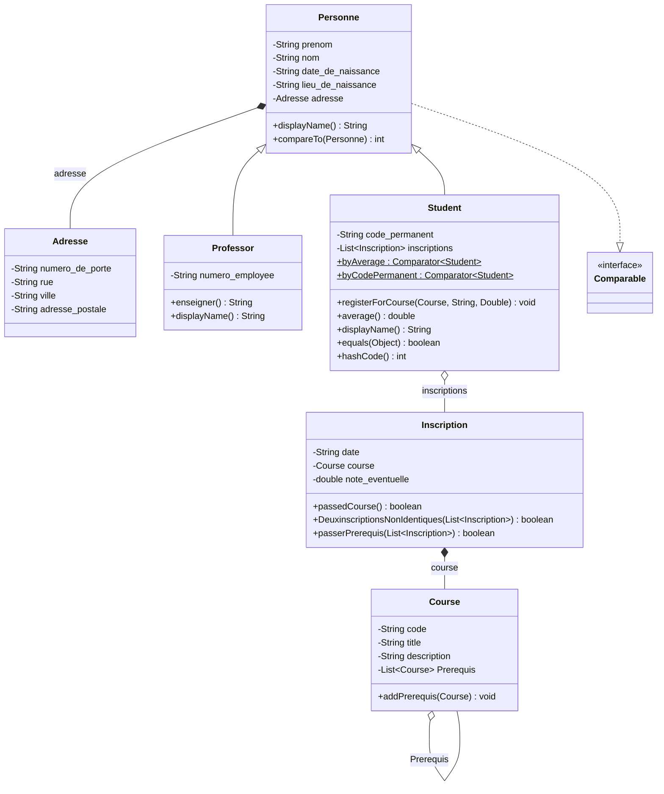

# Diagramme de classes — Laboratoire 1

```mermaid
classDiagram
    class Personne {
        -String prenom
        -String nom
        -String date_de_naissance
        -String lieu_de_naissance
        -Adresse adresse
        +displayName() String
        +compareTo(Personne) int

    }

    class Adresse {
        -String numero_de_porte
        -String rue
        -String ville
        -String adresse_postale

    }

    class Professor {
        -String numero_employee
        +enseigner() String
        +displayName() String

    }

    class Student {
        -String code_permanent
        -List~Inscription~ inscriptions
        +byAverage : Comparator~Student~$
        +byCodePermanent : Comparator~Student~$
        +registerForCourse(Course, String, Double) void
        +average() double
        +displayName() String
        +equals(Object) boolean
        +hashCode() int

    }

    class Course {
        -String code
        -String title
        -String description
        -List~Course~ Prerequis
        +addPrerequis(Course) void

    }

    class Inscription {
        -String date
        -Course course
        -double note_eventuelle
        +passedCourse() boolean
        +DeuxinscriptionsNonIdentiques(List~Inscription~) boolean
        +passerPrerequis(List~Inscription~) boolean

    }

    class Comparable {
        <<interface>>
    }

    Personne ..|> Comparable
    Personne <|-- Professor
    Personne <|-- Student
    Personne *-- Adresse : adresse
    Student o-- Inscription : inscriptions
    Inscription *-- Course : course
    Course o-- Course : Prerequis
```
